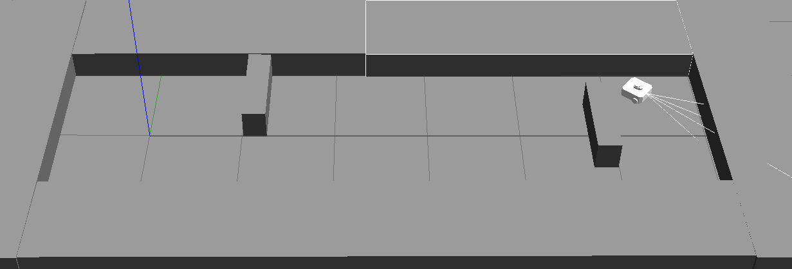
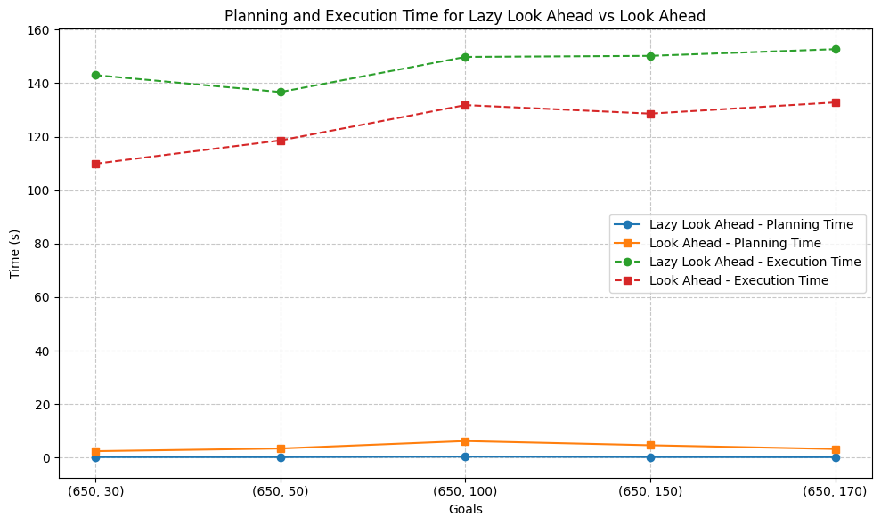

# LOOKAHEAD vs LAZYLOOKAHEAD For ROS2 TurtleBot
This Project implements the AStar planning algorithm along with the Lookahead and LazyLookahead acting algorithms, where in both the acting algorithms were compared in regards to the planning time and the execution time taken by each algorithm in a ROS2 Gazebo environment



## Dependencies:
- ROS2 Humble
- Gazebo
- Turtlebot3
- Python
- C++

## How to Run:
To run the code, first download the cmsc_turtlebot3_project and place it in a folder structure as shown below
```
your_folder/src/cmsc_turtlebot3_project
```

Now navigate to your folder
```
cd /path_to/your_folder
```
Build the ROS2 package:
```
colcon build --packages-select cmsc_turtlebot3_project
```
Once the build completes successfully, source the newly build package
```
source install/setup.bash
```
Now launch the Turtlebot_gazebo
```
ros2 launch cmsc_turtlebot3_project competition_world.launch.py
```

Open a new terminal, navigate to scripts folder in cmsc_turtlebot3_project
```
cd /path_to/your_folder/src/cmsc_turtlebot3_project/scripts
```

Execute the command
```
python3 pid_controller.py
```

If you want to change the algorithm from lookahead to lazylookahead, look for the flag self.lazy_or_not in the pid_controller.py and set it to False for lookahead and True for lazylookahead.


## Experimental Results:

| **Goals**    | **Lazy Look Ahead** Planning Time | **Lazy Look Ahead** Execution Time | **Look Ahead** Planning Time | **Look Ahead** Execution Time |
|--------------|-----------------------------------|------------------------------------|------------------------------|-------------------------------|
| (650, 30)    | 0.217                             | 143.001                            | 2.43                         | 109.90                        |
| (650, 50)    | 0.210                             | 136.70                             | 3.42                         | 118.60                        |
| (650, 100)   | 0.386                             | 149.801                            | 6.22                         | 131.80                        |
| (650, 150)   | 0.240                             | 150.20                             | 4.63                         | 128.60                        |
| (650, 170)   | 0.192                             | 152.702                            | 3.23                         | 132.80                        |
| **Average**  | **0.249**                         | **146.480**                        | **3.986**                    | **124.34**                    |


## Plot

